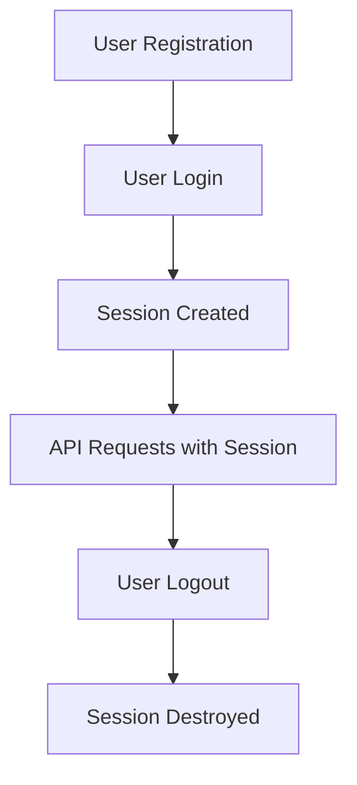

# Postman API Testing Tutorial for Energo

This tutorial provides comprehensive guidance for testing the Energo backend API using Postman. It includes setup instructions, collection examples, and detailed test cases for all available endpoints.

## Table of Contents

1. [Prerequisites](#prerequisites)
2. [Postman Collection Setup](#postman-collection-setup)
3. [Environment Configuration](#environment-configuration)
4. [Authentication Flow](#authentication-flow)
5. [API Endpoints Testing](#api-endpoints-testing)
   - [Authentication Endpoints](#authentication-endpoints)
   - [User Management Endpoints](#user-management-endpoints)
   - [Energy Card Endpoints](#energy-card-endpoints)
   - [Recharge Endpoints](#recharge-endpoints)
6. [Advanced Testing Features](#advanced-testing-features)
7. [Troubleshooting](#troubleshooting)

## Prerequisites

Before starting, ensure you have:

- **Postman** installed (latest version recommended)
- **Energo Backend Server** running on `http://100.76.213.9:4000`
- **Database** properly configured and populated
- **Node.js** environment for the backend

## Postman Collection Setup

### Import Collection

1. Download the Energo Postman collection from the project repository
2. In Postman, click **Import** → **Upload Files**
3. Select the `Energo-API-Collection.json` file
4. The collection will be imported with all endpoints pre-configured

### Collection Structure

The collection is organized into folders:

```
Energo API Collection
├── Authentication
│   ├── User Registration
│   ├── User Login
│   └── User Logout
├── User Management
│   ├── Get Profile
│   ├── Update Profile
│   ├── Change Password
│   └── Update Status
├── Energy Cards
│   ├── List Meters
│   ├── Add Meter
│   ├── Release Meter
│   └── Update Meter Name
└── Recharges
    ├── Create Recharge
    └── Get Recharge History
```

### Ready-to-Use Examples

Below are complete examples you can copy and paste directly into Postman for immediate testing.

## Quick Start Examples

### 1. User Registration Example

**Method**: POST
**URL**: `http://100.76.213.9:4000/api/auth/register`
**Headers**:
```
Content-Type: application/json
```
**Body** (raw JSON):
```json
{
  "username": "testuser123",
  "password": "SecurePassword123!",
  "email": "testuser@example.com",
  "card_number": "1234567890123456",
  "employee_code": "EMP001"
}
```

### 2. User Login Example

**Method**: POST
**URL**: `http://100.76.213.9:4000/api/auth/login`
**Headers**:
```
Content-Type: application/json
```
**Body** (raw JSON):
```json
{
  "username": "testuser123",
  "password": "SecurePassword123!"
}
```

### 3. Get Profile Example

**Method**: GET
**URL**: `http://100.76.213.9:4000/api/me/profile`
**Headers**:
```
Content-Type: application/json
```
*Note: Requires authentication - run login first*

### 4. Create Recharge Example (Amount)

**Method**: POST
**URL**: `http://100.76.213.9:4000/api/recharge`
**Headers**:
```
Content-Type: application/json
```
**Body** (raw JSON):
```json
{
  "amount": 50000,
  "card_number": "1234567890123456"
}
```

### 5. Create Recharge Example (kWh)

**Method**: POST
**URL**: `http://100.76.213.9:4000/api/recharge`
**Headers**:
```
Content-Type: application/json
```
**Body** (raw JSON):
```json
{
  "kwh": 100,
  "card_number": "1234567890123456"
}
```

### 6. Add Meter Example

**Method**: POST
**URL**: `http://100.76.213.9:4000/api/me/meters`
**Headers**:
```
Content-Type: application/json
```
**Body** (raw JSON):
```json
{
  "card_number": "9876543210987654",
  "name": "Oficina Principal"
}
```

### 7. Update Profile Example

**Method**: PUT
**URL**: `http://100.76.213.9:4000/api/me/profile`
**Headers**:
```
Content-Type: application/json
```
**Body** (raw JSON):
```json
{
  "primer_nombre": "Juan",
  "primer_apellido": "Pérez",
  "tipo_identificacion": "CC",
  "numero_identificacion": "12345678",
  "segundo_nombre": "Carlos",
  "segundo_apellido": "Gómez",
  "direccion": "Calle 123 #45-67",
  "telefono": "3001234567"
}
```

### 8. Change Password Example

**Method**: POST
**URL**: `http://100.76.213.9:4000/api/me/password-change`
**Headers**:
```
Content-Type: application/json
```
**Body** (raw JSON):
```json
{
  "current_password": "SecurePassword123!",
  "new_password": "NewSecurePassword456!"
}
```

### 9. List Meters Example

**Method**: GET
**URL**: `http://100.76.213.9:4000/api/me/meters`
**Headers**:
```
Content-Type: application/json
```
*Note: Requires authentication*

### 10. Get Recharge History Example

**Method**: GET
**URL**: `http://100.76.213.9:4000/api/recharge/history`
**Headers**:
```
Content-Type: application/json
```
*Note: Requires authentication*

### 11. Release Meter Example

**Method**: DELETE
**URL**: `http://100.76.213.9:4000/api/me/meters/1234567890123456`
**Headers**:
```
Content-Type: application/json
```
*Note: Requires authentication*

### 12. Update Meter Name Example

**Method**: PATCH
**URL**: `http://100.76.213.9:4000/api/me/meters/1234567890123456`
**Headers**:
```
Content-Type: application/json
```
**Body** (raw JSON):
```json
{
  "name": "Casa Principal"
}
```

### 13. Update Status Example

**Method**: POST
**URL**: `http://100.76.213.9:4000/api/me/status`
**Headers**:
```
Content-Type: application/json
```
**Body** (raw JSON):
```
"Pausa"
```

### 14. User Logout Example

**Method**: POST
**URL**: `http://100.76.213.9:4000/api/auth/logout`
**Headers**:
```
Content-Type: application/json
```
*Note: Requires authentication*

## Environment Configuration

### Create Environment

1. Click the **Environment** dropdown in Postman
2. Select **Manage Environments**
3. Click **Add** and create a new environment named `Energo Dev`
4. Add the following variables:

```json
{
  "base_url": "http://100.76.213.9:4000",
  "api_version": "v1",
  "content_type": "application/json",
  "test_username": "testuser",
  "test_password": "TestPassword123!",
  "test_email": "test@example.com",
  "test_card_number": "1234567890123456",
  "test_employee_code": "EMP001"
}
```

### Environment Variables Usage

- `{{base_url}}`: Base URL for all requests
- `{{content_type}}`: Content-Type header value
- `{{test_username}}`: Test username for authentication
- `{{test_password}}`: Test password for authentication
- `{{test_card_number}}`: Test energy card number
- `{{test_employee_code}}`: Test employee code

## Authentication Flow

### Understanding Session-Based Authentication

Energo uses **session-based authentication** with cookies. This means:

1. **Login** creates a session on the server
2. **Session cookies** are automatically stored by Postman
3. **Subsequent requests** include these cookies automatically
4. **Logout** destroys the session

### Authentication Workflow



## API Endpoints Testing

### Authentication Endpoints

#### 1. User Registration

**Endpoint**: `POST {{base_url}}/api/auth/register`

**Request Body**:
```json
{
  "username": "{{test_username}}",
  "password": "{{test_password}}",
  "email": "{{test_email}}",
  "card_number": "{{test_card_number}}",
  "employee_code": "{{test_employee_code}}"
}
```

**Headers**:
```
Content-Type: {{content_type}}
```

**Copy-Paste Example**:
```json
{
  "username": "testuser123",
  "password": "SecurePassword123!",
  "email": "testuser@example.com",
  "card_number": "1234567890123456",
  "employee_code": "EMP001"
}
```

**Expected Response** (200 OK):
```json
{
  "message": "Registration successful",
  "userId": 123,
  "cardNumber": "1234567890123456"
}
```

**Test Cases**:
- ✅ Valid registration with all required fields
- ❌ Registration with weak password (less than 12 characters)
- ❌ Registration with invalid email format
- ❌ Registration with duplicate username

**Error Response Examples**:

*Weak Password*:
```json
{
  "error": "Password must be at least 12 characters long and contain at least 3 of the following: uppercase letters, lowercase letters, numbers, special characters"
}
```

*Invalid Email*:
```json
{
  "error": "email must be a valid email"
}
```

*Duplicate Username*:
```json
{
  "error": "Username already exists"
}
```

#### 2. User Login

**Endpoint**: `POST {{base_url}}/api/auth/login`

**Request Body**:
```json
{
  "username": "{{test_username}}",
  "password": "{{test_password}}"
}
```

**Headers**:
```
Content-Type: {{content_type}}
```

**Copy-Paste Example**:
```json
{
  "username": "testuser123",
  "password": "SecurePassword123!"
}
```

**Expected Response** (200 OK):
```json
{
  "message": "Login successful"
}
```

**Important**: After successful login, Postman will automatically store session cookies for subsequent requests.

**Test Cases**:
- ✅ Valid login with correct credentials
- ❌ Login with incorrect password
- ❌ Login with non-existent username
- ❌ Login with empty credentials

**Error Response Examples**:

*Incorrect Password*:
```json
{
  "error": "Invalid credentials"
}
```

*Non-existent User*:
```json
{
  "error": "Invalid credentials"
}
```

*Empty Credentials*:
```json
{
  "error": "username is required"
}
```

**Session Information**:
After successful login, you can view the session cookies in Postman:
- Go to **Cookies** → **Manage Cookies**
- Look for cookies from `localhost:4000`
- These cookies will be automatically sent with subsequent requests

#### 3. User Logout

**Endpoint**: `POST {{base_url}}/api/auth/logout`

**Headers**:
```
Content-Type: {{content_type}}
```

**Expected Response** (200 OK):
```json
{
  "message": "Logged out"
}
```

**Test Cases**:
- ✅ Logout when authenticated
- ❌ Logout when not authenticated (should return 401)

### User Management Endpoints

#### 1. Get Profile

**Endpoint**: `GET {{base_url}}/api/me/profile`

**Headers**:
```
Content-Type: {{content_type}}
Cookie: [Session cookies from login]
```

**Expected Response** (200 OK):
```json
{
  "user": {
    "id": 123,
    "username": "testuser",
    "email": "test@example.com",
    "role_name": "user",
    "status_name": "Activo",
    "created_at": "2024-01-01T00:00:00.000Z"
  },
  "profile": {
    "primer_nombre": "John",
    "primer_apellido": "Doe",
    "tipo_identificacion": "CC",
    "numero_identificacion": "12345678",
    "segundo_nombre": "Michael",
    "segundo_apellido": "Smith",
    "direccion": "Calle 123 #45-67",
    "telefono": "3001234567"
  },
  "personal_data_filled": true,
  "cards": [
    {
      "card_number": "1234567890123456",
      "name": "Casa Principal",
      "balance": 100.50,
      "kwh": 50.25,
      "status": "Activa"
    }
  ]
}
```

**Test Cases**:
- ✅ Get profile when authenticated
- ❌ Get profile when not authenticated (should return 401)

#### 2. Update Profile

**Endpoint**: `PUT {{base_url}}/api/me/profile`

**Request Body**:
```json
{
  "primer_nombre": "John",
  "primer_apellido": "Doe",
  "tipo_identificacion": "CC",
  "numero_identificacion": "12345678",
  "segundo_nombre": "Michael",
  "segundo_apellido": "Smith",
  "direccion": "Calle 123 #45-67",
  "telefono": "3001234567"
}
```

**Headers**:
```
Content-Type: {{content_type}}
Cookie: [Session cookies from login]
```

**Expected Response** (200 OK):
```json
{
  "message": "Profile updated"
}
```

**Test Cases**:
- ✅ Update profile with valid data
- ❌ Update profile with missing required fields
- ❌ Update profile when not authenticated

#### 3. Change Password

**Endpoint**: `POST {{base_url}}/api/me/password-change`

**Request Body**:
```json
{
  "current_password": "{{test_password}}",
  "new_password": "NewPassword123!"
}
```

**Headers**:
```
Content-Type: {{content_type}}
Cookie: [Session cookies from login]
```

**Expected Response** (200 OK):
```json
{
  "message": "Password updated"
}
```

**Test Cases**:
- ✅ Change password with valid current and new password
- ❌ Change password with incorrect current password
- ❌ Change password with weak new password
- ❌ Change password when not authenticated

#### 4. Update Status

**Endpoint**: `POST {{base_url}}/api/me/status`

**Request Body**:
```json
"Pausa"
```

**Headers**:
```
Content-Type: {{content_type}}
Cookie: [Session cookies from login]
```

**Expected Response** (200 OK):
```json
{
  "message": "Account paused"
}
```

**Test Cases**:
- ✅ Update status to "Pausa"
- ✅ Update status to "Deshabilitado"
- ❌ Update status with invalid value
- ❌ Update status when not authenticated

### Energy Card Endpoints

#### 1. List Meters

**Endpoint**: `GET {{base_url}}/api/me/meters`

**Headers**:
```
Content-Type: {{content_type}}
Cookie: [Session cookies from login]
```

**Expected Response** (200 OK):
```json
{
  "meters": [
    {
      "card_number": "1234567890123456",
      "name": "Casa Principal",
      "balance": 100.50,
      "kwh": 50.25,
      "status": "Activa"
    },
    {
      "card_number": "9876543210987654",
      "name": "Oficina",
      "balance": 75.25,
      "kwh": 37.63,
      "status": "Activa"
    }
  ]
}
```

**Test Cases**:
- ✅ List meters when authenticated
- ❌ List meters when not authenticated
- ✅ List meters with no cards linked

#### 2. Add Meter

**Endpoint**: `POST {{base_url}}/api/me/meters`

**Request Body**:
```json
{
  "card_number": "9876543210987654",
  "name": "Oficina"
}
```

**Headers**:
```
Content-Type: {{content_type}}
Cookie: [Session cookies from login]
```

**Expected Response** (200 OK):
```json
{
  "meter": {
    "card_number": "9876543210987654",
    "name": "Oficina",
    "balance": 0,
    "kwh": 0,
    "status": "Activa"
  }
}
```

**Test Cases**:
- ✅ Add meter with valid card number and name
- ❌ Add meter with invalid card number format
- ❌ Add meter with duplicate card number
- ❌ Add meter when not authenticated

#### 3. Release Meter

**Endpoint**: `DELETE {{base_url}}/api/me/meters/{{test_card_number}}`

**Headers**:
```
Content-Type: {{content_type}}
Cookie: [Session cookies from login]
```

**Expected Response** (200 OK):
```json
{
  "message": "Meter released"
}
```

**Test Cases**:
- ✅ Release meter when authenticated and owns the meter
- ❌ Release meter when not authenticated
- ❌ Release meter that doesn't exist
- ❌ Release meter that belongs to another user

#### 4. Update Meter Name

**Endpoint**: `PATCH {{base_url}}/api/me/meters/{{test_card_number}}`

**Request Body**:
```json
{
  "name": "Casa Nueva"
}
```

**Headers**:
```
Content-Type: {{content_type}}
Cookie: [Session cookies from login]
```

**Expected Response** (200 OK):
```json
{
  "meter": {
    "card_number": "1234567890123456",
    "name": "Casa Nueva",
    "balance": 100.50,
    "kwh": 50.25,
    "status": "Activa"
  }
}
```

**Test Cases**:
- ✅ Update meter name when authenticated
- ❌ Update meter name when not authenticated
- ❌ Update meter name for non-existent meter

### Recharge Endpoints

#### 1. Create Recharge

**Endpoint**: `POST {{base_url}}/api/recharge`

**Important**: The recharge endpoint uses XOR validation - you must provide exactly ONE of: `amount`, `kwh`, or `pin_code`.

**Option 1 - Recharge by Amount**:

**Copy-Paste Example**:
```json
{
  "amount": 50000,
  "card_number": "1234567890123456"
}
```

**Option 2 - Recharge by kWh**:

**Copy-Paste Example**:
```json
{
  "kwh": 100,
  "card_number": "1234567890123456"
}
```

**Option 3 - Recharge by PIN Code**:

**Copy-Paste Example**:
```json
{
  "pin_code": "STS123456789",
  "card_number": "1234567890123456"
}
```

**Headers**:
```
Content-Type: application/json
```

**Expected Response** (200 OK):
```json
{
  "pin_code": "STS123456789",
  "current_balance": 150000,
  "current_kwh": 150.25
}
```

**Test Cases**:
- ✅ Create recharge with amount
- ✅ Create recharge with kWh
- ✅ Create recharge with PIN code
- ❌ Create recharge with multiple parameters (should return validation error)
- ❌ Create recharge with no parameters
- ❌ Create recharge when not authenticated

**Error Response Examples**:

*Multiple Parameters*:
```json
{
  "error": "Debe proporcionar ya sea amount, kwh o pin_code, pero solo uno"
}
```

*No Parameters*:
```json
{
  "error": "Debe proporcionar ya sea amount, kwh o pin_code, pero solo uno"
}
```

*Invalid Card Number*:
```json
{
  "error": "Card not found or not linked to user"
}
```

*Insufficient Balance for PIN Redemption*:
```json
{
  "error": "Insufficient balance in PIN code"
}
```

**Response Field Explanations**:
- `pin_code`: The generated STS-20 token for the recharge
- `current_balance`: Updated balance in cents after the recharge
- `current_kwh`: Updated energy units after the recharge

#### 2. Get Recharge History

**Endpoint**: `GET {{base_url}}/api/recharge/history`

**Headers**:
```
Content-Type: {{content_type}}
Cookie: [Session cookies from login]
```

**Expected Response** (200 OK):
```json
{
  "history": [
    {
      "id": 1,
      "user_id": 123,
      "card_number": "1234567890123456",
      "amount": 50000,
      "kwh": 50,
      "pin_code": "STS123456789",
      "balance_before": 100000,
      "balance_after": 150000,
      "kwh_before": 100.25,
      "kwh_after": 150.25,
      "created_at": "2024-01-01T10:00:00.000Z"
    },
    {
      "id": 2,
      "user_id": 123,
      "card_number": "1234567890123456",
      "amount": 25000,
      "kwh": 25,
      "pin_code": "STS987654321",
      "balance_before": 150000,
      "balance_after": 175000,
      "kwh_before": 150.25,
      "kwh_after": 175.25,
      "created_at": "2024-01-02T10:00:00.000Z"
    }
  ]
}
```

**Test Cases**:
- ✅ Get recharge history when authenticated
- ❌ Get recharge history when not authenticated
- ✅ Get recharge history with no transactions

## Advanced Testing Features

### Pre-request Scripts

Add pre-request scripts to automate common tasks:

```javascript
// Set authentication headers automatically
pm.globals.set("timestamp", new Date().toISOString());
```

### Test Scripts

Add test scripts to validate responses:

```javascript
// Validate successful response
pm.test("Status code is 200", function () {
    pm.response.to.have.status(200);
});

pm.test("Response time is less than 2000ms", function () {
    pm.expect(pm.response.responseTime).to.be.below(2000);
});

pm.test("Response has required fields", function () {
    const jsonData = pm.response.json();
    pm.expect(jsonData).to.have.property('message');
});
```

### Environment Variables

Use environment variables for dynamic testing:

```javascript
// Set dynamic values
pm.environment.set("dynamic_username", "testuser_" + Math.random().toString(36).substr(2, 9));
```

### Collection Runner

Use the Collection Runner for automated testing:

1. Click **Collections** → Select your collection → **Run**
2. Configure the environment
3. Set iteration count and delay
4. Run the collection

### Mock Servers

Create mock servers for frontend development:

1. Select a request in your collection
2. Click **Mock** → **Create Mock Server**
3. Configure the mock server settings
4. Use the mock URL for frontend testing

## Troubleshooting

### Common Issues

#### 1. Authentication Failures
**Problem**: Getting 401 Unauthorized errors
**Solution**:
- Ensure you're logged in before making authenticated requests
- Check that session cookies are being sent
- Verify the session hasn't expired

#### 2. CORS Errors
**Problem**: CORS policy blocking requests
**Solution**:
- Ensure the backend is configured with correct CORS origins
- Check that `CLIENT_ORIGIN` environment variable includes your Postman origin
- Use the correct base URL

#### 3. Validation Errors
**Problem**: Getting 400 Bad Request with validation errors
**Solution**:
- Check request body format matches API requirements
- Ensure all required fields are present
- Verify data types (numbers vs strings)

#### 4. Database Connection Issues
**Problem**: 500 Internal Server Error
**Solution**:
- Verify database is running and accessible
- Check database connection configuration
- Ensure required tables and stored procedures exist

### Debug Tips

1. **Enable Postman Console**: View detailed request/response logs
2. **Use Environment Variables**: Avoid hardcoded values
3. **Check Headers**: Ensure proper Content-Type and authentication headers
4. **Validate JSON**: Use JSON linting tools to verify request bodies
5. **Test Incrementally**: Start with simple requests and build complexity

### Error Response Examples

**Validation Error**:
```json
{
  "error": "username is required"
}
```

**Authentication Error**:
```json
{
  "error": "Unauthorized"
}
```

**Server Error**:
```json
{
  "error": "Database connection failed"
}
```

## Best Practices

1. **Organize Collections**: Group related endpoints logically
2. **Use Descriptive Names**: Make test names clear and descriptive
3. **Document Tests**: Add comments explaining test purpose
4. **Use Variables**: Avoid hardcoded values in requests
5. **Test Edge Cases**: Include both positive and negative test cases
6. **Monitor Performance**: Track response times and optimize slow endpoints
7. **Version Control**: Keep collections in version control with your code
8. **Regular Updates**: Update collections when API changes

## Complete Postman Collection with Ready-to-Use Links

For immediate testing, you can import this complete Postman collection JSON. Copy the entire JSON below and import it into Postman.

### Complete Collection JSON

```json
{
  "info": {
    "name": "Energo API Collection",
    "description": "Complete API collection for testing Energo backend endpoints",
    "schema": "https://schema.getpostman.com/json/collection/v2.1.0/collection.json",
    "version": "1.0.0"
  },
  "item": [
    {
      "name": "Authentication",
      "item": [
        {
          "name": "User Registration",
          "request": {
            "method": "POST",
            "header": [
              {
                "key": "Content-Type",
                "value": "application/json"
              }
            ],
            "body": {
              "mode": "raw",
              "raw": "{\n  \"username\": \"testuser123\",\n  \"password\": \"SecurePassword123!\",\n  \"email\": \"testuser@example.com\",\n  \"card_number\": \"1234567890123456\",\n  \"employee_code\": \"EMP001\"\n}"
            },
            "url": {
              "raw": "http://localhost:4000/api/auth/register",
              "host": ["localhost"],
              "port": "4000",
              "path": ["api", "auth", "register"]
            }
          }
        },
        {
          "name": "User Login",
          "request": {
            "method": "POST",
            "header": [
              {
                "key": "Content-Type",
                "value": "application/json"
              }
            ],
            "body": {
              "mode": "raw",
              "raw": "{\n  \"username\": \"testuser123\",\n  \"password\": \"SecurePassword123!\"\n}"
            },
            "url": {
              "raw": "http://localhost:4000/api/auth/login",
              "host": ["localhost"],
              "port": "4000",
              "path": ["api", "auth", "login"]
            }
          }
        },
        {
          "name": "User Logout",
          "request": {
            "method": "POST",
            "header": [
              {
                "key": "Content-Type",
                "value": "application/json"
              }
            ],
            "url": {
              "raw": "http://localhost:4000/api/auth/logout",
              "host": ["localhost"],
              "port": "4000",
              "path": ["api", "auth", "logout"]
            }
          }
        }
      ]
    },
    {
      "name": "User Management",
      "item": [
        {
          "name": "Get Profile",
          "request": {
            "method": "GET",
            "header": [
              {
                "key": "Content-Type",
                "value": "application/json"
              }
            ],
            "url": {
              "raw": "http://localhost:4000/api/me/profile",
              "host": ["localhost"],
              "port": "4000",
              "path": ["api", "me", "profile"]
            }
          }
        },
        {
          "name": "Update Profile",
          "request": {
            "method": "PUT",
            "header": [
              {
                "key": "Content-Type",
                "value": "application/json"
              }
            ],
            "body": {
              "mode": "raw",
              "raw": "{\n  \"primer_nombre\": \"Juan\",\n  \"primer_apellido\": \"Pérez\",\n  \"tipo_identificacion\": \"CC\",\n  \"numero_identificacion\": \"12345678\",\n  \"segundo_nombre\": \"Carlos\",\n  \"segundo_apellido\": \"Gómez\",\n  \"direccion\": \"Calle 123 #45-67\",\n  \"telefono\": \"3001234567\"\n}"
            },
            "url": {
              "raw": "http://localhost:4000/api/me/profile",
              "host": ["localhost"],
              "port": "4000",
              "path": ["api", "me", "profile"]
            }
          }
        },
        {
          "name": "Change Password",
          "request": {
            "method": "POST",
            "header": [
              {
                "key": "Content-Type",
                "value": "application/json"
              }
            ],
            "body": {
              "mode": "raw",
              "raw": "{\n  \"current_password\": \"SecurePassword123!\",\n  \"new_password\": \"NewSecurePassword456!\"\n}"
            },
            "url": {
              "raw": "http://localhost:4000/api/me/password-change",
              "host": ["localhost"],
              "port": "4000",
              "path": ["api", "me", "password-change"]
            }
          }
        },
        {
          "name": "Update Status",
          "request": {
            "method": "POST",
            "header": [
              {
                "key": "Content-Type",
                "value": "application/json"
              }
            ],
            "body": {
              "mode": "raw",
              "raw": "\"Pausa\""
            },
            "url": {
              "raw": "http://localhost:4000/api/me/status",
              "host": ["localhost"],
              "port": "4000",
              "path": ["api", "me", "status"]
            }
          }
        }
      ]
    },
    {
      "name": "Energy Cards",
      "item": [
        {
          "name": "List Meters",
          "request": {
            "method": "GET",
            "header": [
              {
                "key": "Content-Type",
                "value": "application/json"
              }
            ],
            "url": {
              "raw": "http://localhost:4000/api/me/meters",
              "host": ["localhost"],
              "port": "4000",
              "path": ["api", "me", "meters"]
            }
          }
        },
        {
          "name": "Add Meter",
          "request": {
            "method": "POST",
            "header": [
              {
                "key": "Content-Type",
                "value": "application/json"
              }
            ],
            "body": {
              "mode": "raw",
              "raw": "{\n  \"card_number\": \"9876543210987654\",\n  \"name\": \"Oficina Principal\"\n}"
            },
            "url": {
              "raw": "http://localhost:4000/api/me/meters",
              "host": ["localhost"],
              "port": "4000",
              "path": ["api", "me", "meters"]
            }
          }
        },
        {
          "name": "Release Meter",
          "request": {
            "method": "DELETE",
            "header": [
              {
                "key": "Content-Type",
                "value": "application/json"
              }
            ],
            "url": {
              "raw": "http://localhost:4000/api/me/meters/1234567890123456",
              "host": ["localhost"],
              "port": "4000",
              "path": ["api", "me", "meters", "1234567890123456"]
            }
          }
        },
        {
          "name": "Update Meter Name",
          "request": {
            "method": "PATCH",
            "header": [
              {
                "key": "Content-Type",
                "value": "application/json"
              }
            ],
            "body": {
              "mode": "raw",
              "raw": "{\n  \"name\": \"Casa Principal\"\n}"
            },
            "url": {
              "raw": "http://localhost:4000/api/me/meters/1234567890123456",
              "host": ["localhost"],
              "port": "4000",
              "path": ["api", "me", "meters", "1234567890123456"]
            }
          }
        }
      ]
    },
    {
      "name": "Recharges",
      "item": [
        {
          "name": "Create Recharge - Amount",
          "request": {
            "method": "POST",
            "header": [
              {
                "key": "Content-Type",
                "value": "application/json"
              }
            ],
            "body": {
              "mode": "raw",
              "raw": "{\n  \"amount\": 50000,\n  \"card_number\": \"1234567890123456\"\n}"
            },
            "url": {
              "raw": "http://localhost:4000/api/recharge",
              "host": ["localhost"],
              "port": "4000",
              "path": ["api", "recharge"]
            }
          }
        },
        {
          "name": "Create Recharge - kWh",
          "request": {
            "method": "POST",
            "header": [
              {
                "key": "Content-Type",
                "value": "application/json"
              }
            ],
            "body": {
              "mode": "raw",
              "raw": "{\n  \"kwh\": 100,\n  \"card_number\": \"1234567890123456\"\n}"
            },
            "url": {
              "raw": "http://localhost:4000/api/recharge",
              "host": ["localhost"],
              "port": "4000",
              "path": ["api", "recharge"]
            }
          }
        },
        {
          "name": "Create Recharge - PIN Code",
          "request": {
            "method": "POST",
            "header": [
              {
                "key": "Content-Type",
                "value": "application/json"
              }
            ],
            "body": {
              "mode": "raw",
              "raw": "{\n  \"pin_code\": \"STS123456789\",\n  \"card_number\": \"1234567890123456\"\n}"
            },
            "url": {
              "raw": "http://localhost:4000/api/recharge",
              "host": ["localhost"],
              "port": "4000",
              "path": ["api", "recharge"]
            }
          }
        },
        {
          "name": "Get Recharge History",
          "request": {
            "method": "GET",
            "header": [
              {
                "key": "Content-Type",
                "value": "application/json"
              }
            ],
            "url": {
              "raw": "http://localhost:4000/api/recharge/history",
              "host": ["localhost"],
              "port": "4000",
              "path": ["api", "recharge", "history"]
            }
          }
        }
      ]
    }
  ],
  "variable": [
    {
      "key": "base_url",
      "value": "http://localhost:4000",
      "type": "string"
    },
    {
      "key": "test_username",
      "value": "testuser123",
      "type": "string"
    },
    {
      "key": "test_password",
      "value": "SecurePassword123!",
      "type": "string"
    },
    {
      "key": "test_email",
      "value": "testuser@example.com",
      "type": "string"
    },
    {
      "key": "test_card_number",
      "value": "1234567890123456",
      "type": "string"
    },
    {
      "key": "test_employee_code",
      "value": "EMP001",
      "type": "string"
    }
  ]
}
```

**How to Import**:
1. Copy the entire JSON above
2. In Postman, click **Import**
3. Select **Paste Raw Text**
4. Paste the JSON and click **Import**
5. The collection will be ready to use with all endpoints pre-configured

## Quick Start Examples - Ready to Copy and Paste

### 1. User Registration

**Method**: POST
**URL**: `http://localhost:4000/api/auth/register`
**Headers**:
```
Content-Type: application/json
```
**Body** (raw JSON):
```json
{
  "username": "testuser123",
  "password": "SecurePassword123!",
  "email": "testuser@example.com",
  "card_number": "1234567890123456",
  "employee_code": "EMP001"
}
```

### 2. User Login

**Method**: POST
**URL**: `http://localhost:4000/api/auth/login`
**Headers**:
```
Content-Type: application/json
```
**Body** (raw JSON):
```json
{
  "username": "testuser123",
  "password": "SecurePassword123!"
}
```

### 3. Get Profile

**Method**: GET
**URL**: `http://localhost:4000/api/me/profile`
**Headers**:
```
Content-Type: application/json
```

### 4. Create Recharge (Amount)

**Method**: POST
**URL**: `http://localhost:4000/api/recharge`
**Headers**:
```
Content-Type: application/json
```
**Body** (raw JSON):
```json
{
  "amount": 50000,
  "card_number": "1234567890123456"
}
```

### 5. Create Recharge (kWh)

**Method**: POST
**URL**: `http://localhost:4000/api/recharge`
**Headers**:
```
Content-Type: application/json
```
**Body** (raw JSON):
```json
{
  "kwh": 100,
  "card_number": "1234567890123456"
}
```

### 6. Add Meter

**Method**: POST
**URL**: `http://localhost:4000/api/me/meters`
**Headers**:
```
Content-Type: application/json
```
**Body** (raw JSON):
```json
{
  "card_number": "9876543210987654",
  "name": "Oficina Principal"
}
```

### 7. Update Profile

**Method**: PUT
**URL**: `http://localhost:4000/api/me/profile`
**Headers**:
```
Content-Type: application/json
```
**Body** (raw JSON):
```json
{
  "primer_nombre": "Juan",
  "primer_apellido": "Pérez",
  "tipo_identificacion": "CC",
  "numero_identificacion": "12345678",
  "segundo_nombre": "Carlos",
  "segundo_apellido": "Gómez",
  "direccion": "Calle 123 #45-67",
  "telefono": "3001234567"
}
```

### 8. Change Password

**Method**: POST
**URL**: `http://localhost:4000/api/me/password-change`
**Headers**:
```
Content-Type: application/json
```
**Body** (raw JSON):
```json
{
  "current_password": "SecurePassword123!",
  "new_password": "NewSecurePassword456!"
}
```

### 9. List Meters

**Method**: GET
**URL**: `http://localhost:4000/api/me/meters`
**Headers**:
```
Content-Type: application/json
```

### 10. Get Recharge History

**Method**: GET
**URL**: `http://localhost:4000/api/recharge/history`
**Headers**:
```
Content-Type: application/json
```

### 11. Release Meter

**Method**: DELETE
**URL**: `http://localhost:4000/api/me/meters/1234567890123456`
**Headers**:
```
Content-Type: application/json
```

### 12. Update Meter Name

**Method**: PATCH
**URL**: `http://localhost:4000/api/me/meters/1234567890123456`
**Headers**:
```
Content-Type: application/json
```
**Body** (raw JSON):
```json
{
  "name": "Casa Principal"
}
```

### 13. Update Status

**Method**: POST
**URL**: `http://localhost:4000/api/me/status`
**Headers**:
```
Content-Type: application/json
```
**Body** (raw JSON):
```
"Pausa"
```

### 14. User Logout

**Method**: POST
**URL**: `http://localhost:4000/api/auth/logout`
**Headers**:
```
Content-Type: application/json
```

## Conclusion

This tutorial provides a comprehensive guide for testing the Energo API using Postman. By following these instructions, you can:

- Set up a complete testing environment
- Test all API endpoints thoroughly
- Validate authentication flows
- Monitor API performance
- Troubleshoot common issues

**Quick Start**:
1. Copy the Postman Collection JSON above
2. Import it into Postman
3. Start testing immediately with pre-configured examples

Remember to update your Postman collection whenever the API changes and to include new endpoints in your testing workflow.